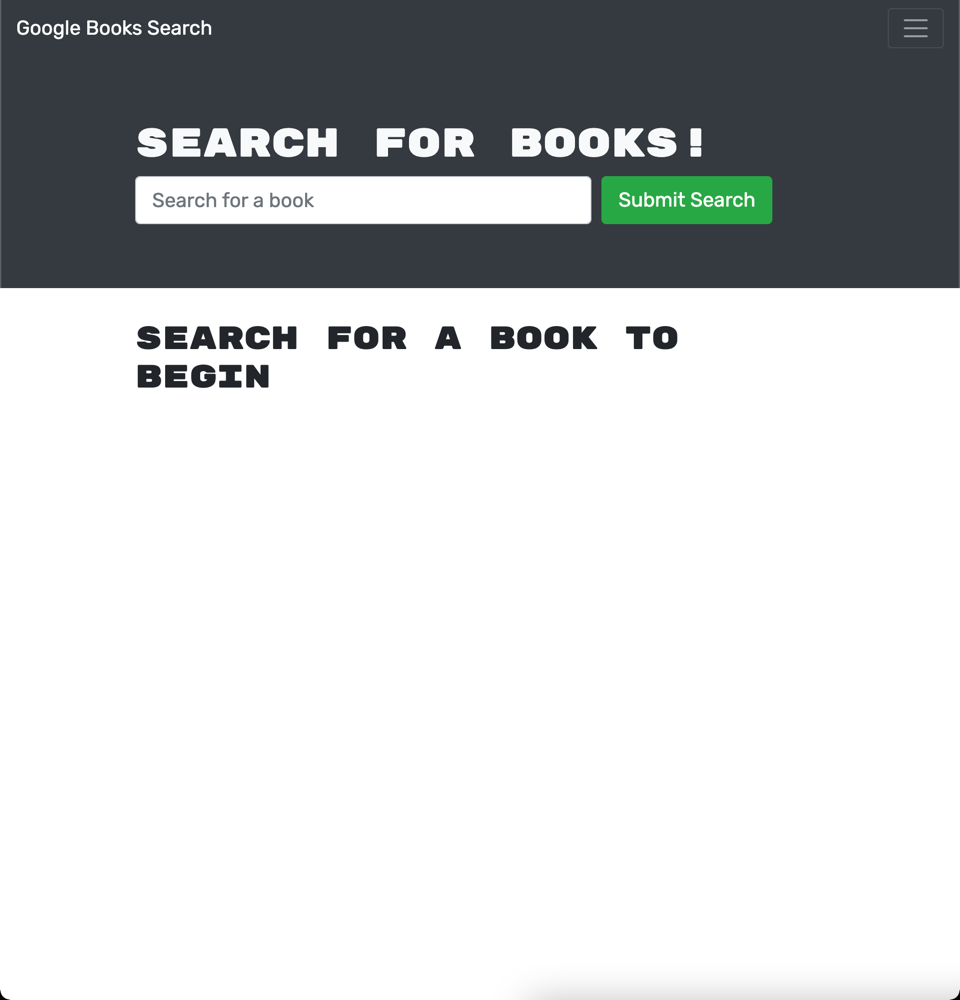

# MERN Book Wishlist

## Table of Contents
* [Description](##description)
* [Screenshot](##screenshot)
* [Deployed App](##deployed-app)
* [Installation Instructions](##installation)
* [Usage Details](##usage)
* [Contribution Guidelines](##contribution-guidelines)
* [Testing Instructions](##testing-instructions)
* [Questions?](##questions?)
* [License Info](##license)

## Description

This is a project that combs the Google Books API and allows users to search for books and add them to a list as well as remove them while leveraging the MERN stack and GraphQL for routing data back to the NOSQL DB

## Screenshot

## Deployed App
Click Here: https://dashboard.heroku.com/apps/protected-crag-88725/deploy/github

## Installation

Git clone the repo and npm i from the root directory to install dependencies.  Run `npm run develop` in root folder to run concurrently the react app and db

## Usage

Use as desired

## Contribution Guidelines

Feel free to add pull requests as you see fit

## Testing Instructions

See installation instructions

## Questions?

Check out my Github: http://www.github.com/mkohn4
Email Me: kohn.max@gmail.com

## License
MIT License

        Copyright (c) 2022 mkohn4
        
        Permission is hereby granted, free of charge, to any person obtaining a copy
        of this software and associated documentation files (the "Software"), to deal
        in the Software without restriction, including without limitation the rights
        to use, copy, modify, merge, publish, distribute, sublicense, and/or sell
        copies of the Software, and to permit persons to whom the Software is
        furnished to do so, subject to the following conditions:
        
        The above copyright notice and this permission notice shall be included in all
        copies or substantial portions of the Software.
        
        THE SOFTWARE IS PROVIDED "AS IS", WITHOUT WARRANTY OF ANY KIND, EXPRESS OR
        IMPLIED, INCLUDING BUT NOT LIMITED TO THE WARRANTIES OF MERCHANTABILITY,
        FITNESS FOR A PARTICULAR PURPOSE AND NONINFRINGEMENT. IN NO EVENT SHALL THE
        AUTHORS OR COPYRIGHT HOLDERS BE LIABLE FOR ANY CLAIM, DAMAGES OR OTHER
        LIABILITY, WHETHER IN AN ACTION OF CONTRACT, TORT OR OTHERWISE, ARISING FROM,
        OUT OF OR IN CONNECTION WITH THE SOFTWARE OR THE USE OR OTHER DEALINGS IN THE
        SOFTWARE.

